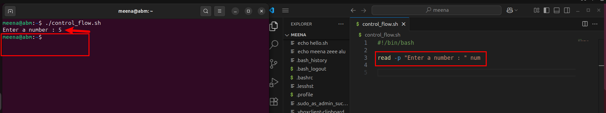

# Linux_Shell_Scripting-Control-Flows-

## Intoduction 
In this mini-project, we are going to discuss about control flows and showcase how you can evaluate them in a script or program in shell scripting(Like Bash).

## What is control Flows  ?

Control flow in programming refers to the order in which individual instructions or statement are executed or evaluated in a script or program. Control flow determine how your scripts decide what to do next based on condition, doing something repeatedly and choices.
It is like a Roadmap. imaging when you give an instruction and you say: "if there is heat in the room,switch on the fan. Otherwise switch it off. Then check in the room. If the fridge is off, on it." This example is exactly what we call control flow.
Bash and other shell interpreters provide control flow statement like : 

1. if/else
2. for loops
3. While loops
4. case.

## If/ else 
If / else decide between two or more actions. The Entire script of how to if/else is:

.

## The Script Break down:

A. The control_flow.sh : is a file we created which will use to run the script in the Terminal.

B. #!/bin/bash : This is what we call the shebang line. It is use to tell the system the type of shell you want to interprete your code.

c. read -p "Enter a number : " num : In shell scripting there is what we call "read user input". This allow a user to enter a  variable. so this command read is what it does. But when you run this command alone " read -p "Enter a number : " num" the script will ask you to enter a variable but it won't print it out. Why ? because you did not you use the "echo command".Example :

when you look at this example, we execute our script with the read command and we input the number but nothing has shown.
However, when we run our  script with the echo command which its fuction is to print out, has now print out our input.

## The If statement:
This allow user to execute commands basd on condition. Example whn we say ;

.

## Break down :
- the "IF": start the conditional statement
- [ condition]: Bracket are used to enclose the condition.
- then: if the condition is met, execute the command.
- fi: this is what end the if statement. it is basically if spelled in backward.
 So in this script you are saying that if the value of number is greater than ziro then you have entered a positive number.

 ## elif statement:

 when you have two conditions and you want to execute them at same time , that is when you need to use elif statement. it stands as else if. example;

 

 in this script, you are telling the system to print outcome as positive if the number is greater than 3. Again if that condition is not met and the number is less than 3, it print it as nagetive.

 
 ## Loops :
 Loops are programming language that let you run the same set of command multiple times automatically. Assuming you want to send a message to five people, instaed of you to send it one by one , you could now use loops to write a single set of instruction that can be executed as many as needed.
 In Bash scripting, there are three types of loops commonly use to repeat a set of command multiple times. These are ; 1.for loop, 2.while loop and 3.untill loop.

 ## For loop:
 this is use to repeat a set of commands for each item in a list. The For loops has two main forms:
 
 1. List form : this repeat over a list of items, and its  basic syntax is :

 "for item in item1 item2 item3;
  do
    echo $item

    Break down; 

    -for : initiate the the loop.
    -item : this is a variable that temporarily holds the value of each item.
    -in : this is followed by the list of item that the loop will repeat.
    -; : the semi-colon is used to saparate the list of items from the do.
    -do : This proceed the block of cpmmand that will be executed for each item in the list.
    -done : this mark the end of the loop.

2. C-style form : this allow you to specify an innitializer, condition, and increament/decreament expression. 

## Task using for loops

## script one For loop

.

## script two c-style for loops

## Looping through file
  
.

## conclusion 
This is a brief explanation of how you could used control flow statements using shell scripting.